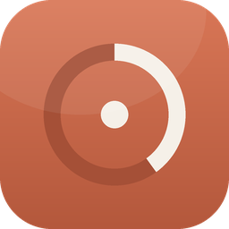
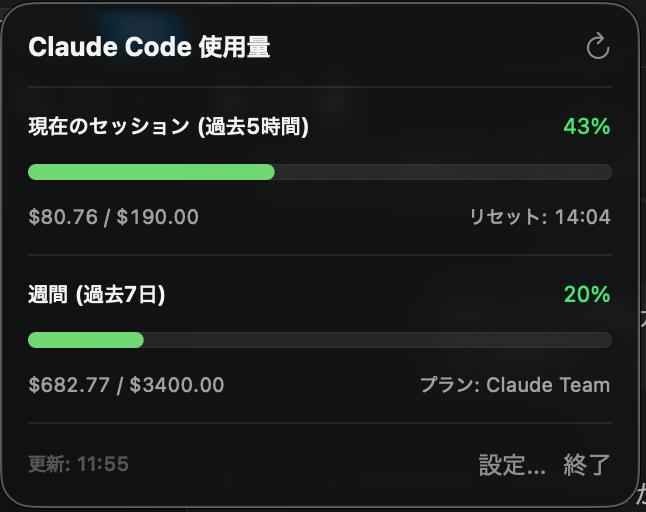

<p align="center">
  
</p>

<h1 align="center">Claude Code Meter</h1>

<p align="center">
  Mac のメニューバーで <strong>Claude Code の使用量</strong>（5時間セッション / 週間）を一目で確認できる小さなアプリ。
</p>

## スクリーンショット

<table>
  <tr>
    <th>メニューバー</th>
    <th>クリックで詳細</th>
  </tr>
  <tr>
    <td></td>
    <td></td>
  </tr>
</table>

## できること

- メニューバーにリングメーター + 使用率の数字を表示 (AirPods バッテリー風)
- クリックすると、5時間セッションと週間（7日）使用量・$ コスト・残り時間を表示
- プラン（Pro / Max 5x / Max 20x / Claude Team / Custom）を選んで上限を設定
- 1分ごとに自動更新（10秒〜15分から変更可能）

## できないこと（v1 の限界）

このアプリは `~/.claude/projects/**/*.jsonl` を読みます。なので含まれるのは:

- ✅ Claude Code（CLI / VS Code 拡張）の使用量

含まれないのは:

- ❌ claude.ai（ブラウザ）からの使用
- ❌ Claude Desktop アプリからの使用

Pro/Max の上限は Anthropic サーバー側で 3つ全部を合算した値を見ているので、このアプリの数字は「下限の目安」と思ってください。

## プライバシー

このアプリは `~/.claude/projects/**/*.jsonl` 内の **`usage` ブロック** (input/output/cache の token 数、モデル名、タイムスタンプ、メッセージ ID) を集計します。

- **集計に使うフィールド:** `usage`、`model`、`timestamp`、メッセージ ID のみ
- **集計に使わないフィールド** (プロンプト本文・assistant 応答・コードベース内容など): 抽出せず、集計後に破棄
- **メモリ上の一時展開:** `JSONSerialization` の仕様上、JSONL の 1 行を一旦 `[String: Any]` 辞書に展開します。本文系もこの辞書に含まれますが、必要フィールドを取った直後にスコープを抜け破棄されます。**永続化・ネットワーク送信は一切ありません**
- **保存先:** UserDefaults にプラン・しきい値・更新間隔のみ (機微情報なし)
- **読み取り範囲のガード:** symlink は解決してパス区切り込みで `~/.claude/projects/` 配下に限定。FIFO・特殊ファイルは除外。1 ファイル 100 MB / 1 行 8 MB 超は安全のためスキップ

## セキュリティ

配布バイナリは Hardened Runtime + ad-hoc 署名で固めています (`codesign --options runtime`)。Apple Developer 署名・notarization はしていないので、初回起動時は spctl(Gatekeeper) で拒否され、「システム設定 > プライバシーとセキュリティ」で「このまま開く」許可が必要です。

**公開配布したい場合は別途:**
- Apple Developer Program ($99/年) で Developer ID 署名
- `xcrun notarytool` で notarization
- 可能なら App Sandbox 化し、~/.claude/ へのアクセスを security-scoped bookmark で取得

現状は「signed したい人が自分でビルドして使う」前提の作りです。

## 動作要件

- macOS 14 (Sonoma) 以降
- Apple Silicon または Intel
- Claude Code を Pro/Max サブスクで使っていること（API キー利用では意味がありません）

## インストール（配布物から）

1. [Releases](#) から `ClaudeCodeMeter-x.y.z.zip` をダウンロード
2. ダブルクリックで展開し、`ClaudeCodeMeter.app` を `/Applications` にドラッグ
3. 初回起動時:
   - 「開発元を確認できないため開けません」と出る場合 → **システム設定 > プライバシーとセキュリティ** で「このまま開く」をクリック
   - 二度目以降は普通に開けます
4. メニューバー右側に `🌀 0%` のようなアイコンが出れば成功

## 開発・自前ビルド

```sh
# 1. clone
git clone <この repo>
cd ClaudeCodeMeter

# 2. ビルドして .app バンドルを作成
./scripts/bundle.sh           # release ビルド (universal binary)
./scripts/bundle.sh debug     # debug ビルド (現在の arch のみ、速い)

# 3. 起動
open dist/ClaudeCodeMeter.app
```

### Xcode で開く場合

```sh
open Package.swift
```

これで Xcode が Swift Package として開き、`Cmd + R` で実行できます（ただし `Cmd + R` で起動した時は LSUIElement=YES の Info.plist が適用されないので、メニューバーに加えて Dock にもアイコンが出ることがあります。バンドルした `.app` 経由なら正しく動きます）。

## ディレクトリ構成

```
ClaudeCodeMeter/
├── Package.swift                          # SwiftPM 設定
├── Resources/Info.plist                   # .app バンドル用 (LSUIElement=YES でメニューバー専用)
├── Sources/ClaudeCodeMeter/
│   ├── ClaudeCodeMeterApp.swift           # @main エントリ
│   ├── Models/
│   │   ├── Plan.swift                     # Pro / Max 5x / Max 20x / Custom
│   │   ├── ModelPricing.swift             # 1M tokens あたりの USD 単価
│   │   └── UsageEntry.swift               # 1メッセージの使用記録
│   ├── Services/
│   │   ├── JSONLLoader.swift              # ~/.claude/projects/**/*.jsonl パーサ
│   │   └── UsageStore.swift               # 集計 + 設定 ObservableObject
│   └── Views/
│       ├── MenuBarLabelView.swift         # メニューバー上の表示
│       ├── MenuBarContentView.swift       # クリック時のポップオーバー
│       └── SettingsView.swift             # 設定ウィンドウ
└── scripts/bundle.sh                      # swift build → .app バンドル化
```

## プラン上限の目安について

Anthropic は Pro/Max/Team の上限を厳密な数値で公開していません。アプリ内のデフォルトはコミュニティ報告と特定ユーザーのキャリブレーション値からの「概算」で、Opus ヘビー利用を想定しています:

| プラン       | 5時間セッション (USD換算) | 週間 (USD換算) |
|--------------|---|---|
| Pro          | $5    | $30    |
| Max 5x       | $30   | $200   |
| Max 20x      | $150  | $1,000 |
| Claude Team  | $190  | $3,400 |

これらは Anthropic の内部指標 (おそらく Sonnet 換算 compute 時間) を $ 換算したもので、必ず一致するわけではありません。実値とズレが大きい時は **Custom** を選んで自分の値を入れてください。

## 配布（メンテナ向け）

```sh
./scripts/bundle.sh
cd dist
zip -r ClaudeCodeMeter-$(date +%Y%m%d).zip ClaudeCodeMeter.app
```

できた `.zip` を GitHub Releases にアップロード。Apple Developer 署名・公証はしていないので、利用者は初回「システム設定 > プライバシーとセキュリティ」で許可する必要があります。

## ライセンス

MIT
