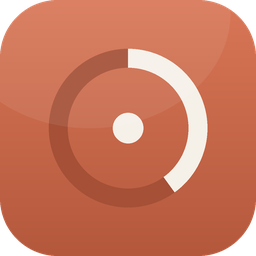
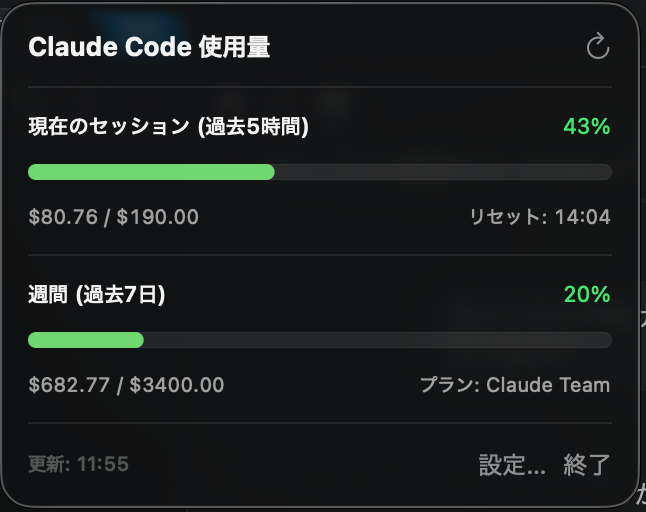

<p align="center">
  
</p>

<h1 align="center">Claude Code Meter</h1>

<p align="center">
  Mac のメニューバーで <strong>Claude Code の使用量</strong>（5時間セッションブロック / 週間）を一目で確認できる小さなアプリ。
</p>

## スクリーンショット

<table>
  <tr>
    <th>メニューバー</th>
    <th>クリックで詳細</th>
  </tr>
  <tr>
    <td></td>
    <td></td>
  </tr>
</table>

## できること

- メニューバーにリングメーター + 使用率の数字を表示 (AirPods バッテリー風)
- クリックすると、5時間セッションブロックと週間の使用量・$ コスト・リセット時刻を表示
- プラン（Pro / Max 5x / Max 20x / Claude Team / Custom）を選んで上限を設定
- `/usage` に出ている % を入れると、上限を実測から較正できる
- 週次リセット日時と cache read の計上率を設定
- 1分ごとに自動更新（10秒〜15分から変更可能）

### 集計の単位

**セッション**は Claude Code と同じ 5 時間ブロックで数えます。ブロックは「最初のメッセージの時刻を時間単位に切り下げた時点」から始まり、ブロック開始から 5 時間経過するか、5 時間の無活動が続くと次のブロックに移ります。直近 5 時間のローリング集計ではないので、前のブロックのコストを引きずりません。

**週間**は設定したリセット日時を起点に、7 日周期で区切ります。`/usage` の「Resets in 2d」は日単位に丸められているので、ここから逆算した起点は最大 1 日ずれます。実測では起点が 6 時間ずれるだけで集計額が 2 割動いたので、claude.ai の使用量画面に出る正確なリセット時刻を入れてください。

## できないこと: claude.ai と Desktop アプリの分は見えない

このアプリは `~/.claude/projects/**/*.jsonl` を読みます。なので含まれるのは:

- ✅ Claude Code（CLI / VS Code 拡張）の使用量

含まれないのは:

- ❌ claude.ai（ブラウザ）からの使用
- ❌ Claude Desktop アプリからの使用

Anthropic のサーバーは 3 つ全部を合算した値で上限を見ています。このアプリが読むのはローカルの Claude Code 分だけなので、数字は「下限の目安」です。

見えない使用量は、合計額に加えて**ウィンドウの起点そのものも動かします**。5 時間ブロックが claude.ai 側の操作で始まっていると、ローカルのログには境界が現れません。セッション % が `/usage` より高めに出るのはこれが理由です。ズレは後述の「上限値は目安。ズレたら `/usage` で較正する」で吸収できます。

## プライバシー

このアプリが `~/.claude/projects/**/*.jsonl` から読むのは、assistant 応答に付いている **`usage` ブロック**だけです。

- **集計に使うフィールド:** `usage`、`model`、`timestamp`、メッセージ ID のみ
- **集計に使わないフィールド** (プロンプト本文・assistant の応答本文・コードベース内容など): 抽出せず、集計後に破棄
- **メモリ上の一時展開:** `JSONSerialization` の仕様上、JSONL の 1 行を一旦 `[String: Any]` 辞書に展開します。本文系もこの辞書に含まれますが、必要フィールドを取った直後にスコープを抜け破棄されます。**永続化・ネットワーク送信は一切ありません**
- **保存先:** UserDefaults にプラン・しきい値・更新間隔・cache read 計上率・週次リセット設定のみ (機微情報なし)
- **読み取り範囲のガード:** symlink は解決してパス区切り込みで `~/.claude/projects/` 配下に限定。FIFO・特殊ファイルは除外。1 ファイル 100 MB / 1 行 8 MB 超は安全のためスキップ

## セキュリティ

配布バイナリは Hardened Runtime + ad-hoc 署名で固めています (`codesign --options runtime`)。ただし Apple Developer 署名も notarization もしていません。そのため初回起動は Gatekeeper (spctl) に拒否されます。「システム設定 > プライバシーとセキュリティ」で「このまま開く」を押してください。

**公開配布したい場合は別途:**
- Apple Developer Program ($99/年) で Developer ID 署名
- `xcrun notarytool` で notarization
- 可能なら App Sandbox 化し、~/.claude/ へのアクセスを security-scoped bookmark で取得

現状は「signed したい人が自分でビルドして使う」前提の作りです。

## 動作要件

- macOS 14 (Sonoma) 以降
- Apple Silicon または Intel
- Claude Code を Pro/Max サブスクで使っていること（API キー利用では意味がありません）

## インストール（配布物から）

1. [Releases](https://github.com/rararax16/claude-code-meter/releases/latest) から `Claude-Code-Meter-x.y.z.zip` をダウンロード
2. ダブルクリックで展開し、`Claude Code Meter.app` を `/Applications` にドラッグ
3. 初回起動時:
   - 「開発元を確認できないため開けません」と出る場合 → **システム設定 > プライバシーとセキュリティ** で「このまま開く」をクリック
   - 二度目以降は普通に開けます
4. メニューバー右側にリングメーターのアイコンが出れば成功

### Mac 起動時に自動起動するには
**システム設定 > 一般 > ログイン項目** で `Claude Code Meter` を追加。

## アンインストール

1. メニューバーのアイコンをクリック → **終了** で常駐解除
2. `/Applications/Claude Code Meter.app` をゴミ箱へ
3. (任意) 設定値をきれいに消したい場合はターミナルで:
   ```sh
   defaults delete dev.local.claudecodemeter
   ```
4. (任意) ログイン項目に登録していた場合は **システム設定 > 一般 > ログイン項目** から外す

このアプリは上記以外のファイル (キャッシュ・サポートディレクトリ等) を一切作りません。`~/.claude/` 配下のデータは **読み取り専用** なので、アンインストールしても Claude Code 本体には影響しません。

## 開発・自前ビルド

```sh
# 1. clone
git clone https://github.com/rararax16/claude-code-meter.git
cd claude-code-meter

# 2. ビルドして .app バンドルを作成
./scripts/bundle.sh           # release ビルド (universal binary)
./scripts/bundle.sh debug     # debug ビルド (現在の arch のみ、速い)

# 3. 起動（.app 名はスペース入り）
open "dist/Claude Code Meter.app"

# 4. テスト
swift test
```

### Xcode で開く場合

```sh
open Package.swift
```

Xcode が Swift Package として開き、`Cmd + R` で実行できます。

ただし `Cmd + R` 起動では `LSUIElement=YES` の Info.plist が適用されません。メニューバーに加えて Dock にもアイコンが出ることがあります。バンドルした `.app` 経由なら正しく動きます。

## ディレクトリ構成

```
claude-code-meter/
├── Package.swift                          # SwiftPM 設定
├── Resources/Info.plist                   # .app バンドル用 (LSUIElement=YES でメニューバー専用)
├── Sources/ClaudeCodeMeter/
│   ├── ClaudeCodeMeterApp.swift           # @main エントリ
│   ├── Models/
│   │   ├── Plan.swift                     # Pro / Max 5x / Max 20x / Team / Custom
│   │   ├── ModelPricing.swift             # 1M tokens あたりの USD 単価
│   │   └── UsageEntry.swift               # 1メッセージの使用記録
│   ├── Services/
│   │   ├── JSONLLoader.swift              # ~/.claude/projects/**/*.jsonl パーサ
│   │   └── UsageStore.swift               # 集計 + 設定 ObservableObject
│   └── Views/
│       ├── MenuBarLabelView.swift         # メニューバー上の表示
│       ├── MenuBarContentView.swift       # クリック時のポップオーバー
│       └── SettingsView.swift             # 設定ウィンドウ
├── Tests/ClaudeCodeMeterTests/            # 5時間ブロック・週次ウィンドウ・パーサ境界
└── scripts/bundle.sh                      # swift build → .app バンドル化
```

## 上限値は目安。ズレたら `/usage` で較正する

Anthropic は Pro/Max/Team の上限を厳密な数値で公開していません。アプリ内のデフォルトはコミュニティ報告と特定ユーザーのキャリブレーション値からの「概算」で、Opus ヘビー利用を想定しています:

| プラン       | 5時間セッション (USD換算) | 週間 (USD換算) |
|--------------|---|---|
| Pro          | $5    | $30    |
| Max 5x       | $30   | $200   |
| Max 20x      | $150  | $1,000 |
| Claude Team  | $190  | $3,400 |

これらは Anthropic の内部指標 (おそらく Sonnet 換算 compute 時間) を $ 換算したものなので、必ず一致するわけではありません。手で合わせたい場合は **Custom** を選んで自分の値を入れてください。

### 較正の手順

推定に頼らず、実測から合わせられます。

1. Claude Code で `/usage` を実行し、`Session (5hr)` と `Weekly (7 day)` の % を控える
2. 設定 > **`/usage` で較正** に、その 2 つの数字を入れる
3. 「この値で較正」を押す

アプリ自身の集計額から `上限 = 集計額 ÷ (実測% ÷ 100)` を逆算し、Custom プランとして保存します。それだけの計算なので、ズレを感じたらいつでも押し直せます。claude.ai や他デバイスの使用量がこのアプリから見えないぶんも、まとめて吸収されます。

### cache read の計上率

既定では cache read を API 定価どおり（Opus なら $1.50 / 1M tokens）全額計上します。設定 > プラン消費の見積もり で 0〜100% に変更できます。

Opus の長コンテキストでは、ターン数 × コンテキスト長でキャッシュ読み出しが積み上がります。実測した 5 時間ブロックでは cache read が 2.2 億トークンに達し、API 換算コストの 87% を占めました。これだけ偏ると割り引きたくなりますが、`/usage` と突き合わせると全額計上のほうが実測に近い値になります。Anthropic 自身も「長いセッションはキャッシュされていても高くつく」と表示します。

計上率を下げると % を抑えられますが、実測からは離れます。API 換算の実コストはポップオーバーに常に併記されるので、下げても元の額は確認できます。

## 配布（メンテナ向け）

```sh
./scripts/bundle.sh
cd dist
zip -r "Claude-Code-Meter-$(date +%Y%m%d).zip" "Claude Code Meter.app"
```

できた `.zip` を GitHub Releases にアップロード。Apple Developer 署名・公証はしていないので、利用者は初回「システム設定 > プライバシーとセキュリティ」で許可する必要があります。

## ライセンス

MIT
